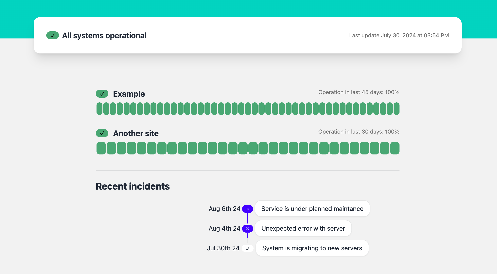

# GitHub Status Page

GitHub Status Page is the open-source status page, powered entirely by GitHub Actions, Issues, and Pages.



# Usage

First of all, you need to fork this repository.

## Update URL's

Update the URLs in `.github/workflows/health-check.yml`.

You need to search for a job named `Fetch Metrics` and modify the `SOURCES` field.

```yml
- name: Health Check
  run: npm start
  id: metrics
  env:
    SOURCES: |
      GitHub->https://github.com
      Facebook->https://facebook.com
```

The format to follow is: `SiteName->SiteUrl`. Use the `->` as the delimiter between the name you want to display and the URL.

You can also set this up as a [`repository secret`](https://docs.github.com/en/actions/security-for-github-actions/security-guides/using-secrets-in-github-actions) if you want to keep the health url private.

## Deployment setup

Then, you need to enable GitHub Pages on your forked repository. You can do this by going to `Settings > Pages` and enabling it on the `main` branch.

In Build and deployment section select GitHub Actions.

## Enable actions

Go to the `Actions` tab and enable workflows to run.

## Change monitoring interval

If you want to change the time interval of monitoring then you can change it in `.github/workflows/health-check.yml` file. Update the cron time in the following line.

```yaml
schedule:
  - cron: '0 0/12 * * *'
```

## Reporting your first incident

1. Go to issues tab
2. Create a new label named `incident`
3. Create a issue
4. Add the label `incident` to the issue

# How it works

- Hosting
  - GitHub Pages is used for hosting the status page.
- Monitoring
  - Github Workflow will be triggered every 2 Hr (Configurable) to visit the website.
  - Response status is compiled and the site is rebuild with the new information.
- Incidents
  - Github issue is used for incident management.

# Credits

<a target="_blank" href="https://icons8.com/icon/14835/heart-monitor">Heartbeat</a> favicon by <a target="_blank" href="https://icons8.com">Icons8</a>

Project is mainly inspired by [mehatab/fettle](https://github.com/mehatab/fettle).
Main difference between this project and fettle are:

- This project was built in SvelteKit.
- It doesn't commit the status log, instead it is stored as an artifact.
- You can set up your health urls as a secret by using [`repository secrets`](https://docs.github.com/en/actions/security-for-github-actions/security-guides/using-secrets-in-github-actions).
- You can host it in any GitHub pages. You [don't need a custom url](https://github.com/mehatab/fettle/issues/20).
